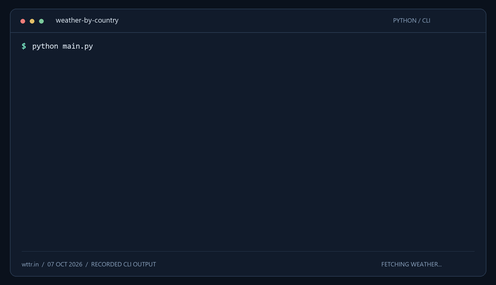

<div align="center">

<h1>Weather by Country</h1>
<p>Текущая погода в городах. Статистика по странам. Интерактивный HTML-отчёт.</p>

<p>
  <a href="https://www.docker.com/"></a>
  <a href="https://www.python.org/"></a>
  <a href="https://github.com/huksleva/weather-by-country/actions/workflows/tests.yml"></a>
  
  
  
  
  <a href="LICENSE"></a>
</p>

<p>
  <a href="#html-отчёт">HTML-отчёт</a> ·
  <a href="#демонстрация">Демонстрация</a> ·
  <a href="#быстрый-старт">Быстрый старт</a> ·
  <a href="#использование">Использование</a> ·
  <a href="#проверка">Проверка</a> ·
  <a href="CONTRIBUTING.md">Contributing</a> ·
  <a href="SECURITY.md">Security</a>
</p>

</div>

Консольная программа на Python: читает список городов из файла, запрашивает
текущую температуру через [wttr.in](https://github.com/chubin/wttr.in#json-output)
и группирует результаты по странам. Проект создан как решение тестового задания;
все температуры и итоговые показатели получаются и вычисляются во время запуска.

- **Три платформы:** Windows 11, Linux и macOS; запуск через Docker Compose.
- **Отчёт в браузере:** карточки городов, поиск, фильтры, сортировка и печать в PDF.
- **Без установки пакетов:** только стандартная библиотека, без API-ключа.
- **Один город — один результат:** пустые строки и повторы удаляются до запросов.
- **Статистика по странам:** количество городов, среднее, минимум и максимум.
- **Обработка сбоев:** тайм-ауты, повторные попытки и явное предупреждение о неполных данных.

## HTML-отчёт


Настоящий отчёт после запуска через Docker **9 октября 2026 года**.
Данные получены от API; при следующем запуске значения могут измениться.

По завершении расчётов программа сохраняет самостоятельный HTML-файл:

- Количество обработанных городов, число стран, средняя температура и общий диапазон.
- Карточки стран: среднее, минимум, максимум и количество городов. Все графики используют одну шкалу.
- Поиск по городу или стране, фильтр по стране, сортировка по температуре и названию.
- Адаптивное оформление для компьютера и телефона, кнопка **Печать / PDF**.
- При ошибках API — статус неполных данных и список пропущенных городов с причинами.

Файл работает офлайн: стили, графики и JavaScript встроены, внешние шрифты
и сервисы не подключаются. Отчёт отражает данные на момент запуска и сам не обновляет погоду.
Фильтры меняют список карточек; общие показатели и статистика стран сохраняют полный результат запуска.
При печати используется выбранный список городов; формат PDF выбирается в диалоге браузера.

## Демонстрация



Реальный вывод `python main.py`, записанный **7 октября 2026 года** и оформленный
как терминальная демонстрация. GIF воспроизводит вывод с сокращёнными паузами.
При новом запуске значения будут зависеть от ответа API.

[Статический снимок](docs/assets/demo.png) · [Текстовая версия вывода](docs/assets/demo.txt)

## Быстрый старт

### Через Docker с автоматическим открытием отчёта

Установите и запустите Docker. Python на компьютере для этого варианта не нужен.

| Система | Требования |
| --- | --- |
| Windows 11 | [Docker Desktop](https://docs.docker.com/desktop/setup/install/windows-install/) с WSL 2 и режимом Linux containers |
| macOS, Intel или Apple Silicon | [Docker Desktop](https://docs.docker.com/desktop/setup/install/mac-install/) для своей архитектуры |
| Linux, AMD64 или ARM64 | [Docker Engine](https://docs.docker.com/engine/install/) и [плагин Compose](https://docs.docker.com/compose/install/linux/), либо Docker Desktop |

Сначала клонируйте проект:

```console
git clone https://github.com/huksleva/weather-by-country.git
cd weather-by-country
```

Запустите скрипт своей системы из папки проекта:

| Система | Команда |
| --- | --- |
| Windows 11, CMD | `run.cmd` |
| Windows 11, PowerShell | `.\run.cmd` |
| Linux или macOS | `sh run.sh` |

Скрипт собирает и запускает контейнер, сохраняет новый отчёт в `reports/`
и открывает его в браузере по умолчанию. Каждый запуск создаёт отдельный файл;
отчёт остаётся на компьютере после удаления контейнера.
На Linux для открытия нужен графический сеанс и `xdg-open`; на macOS используется `open`.
На сервере без браузера HTML можно открыть вручную на другом компьютере.

Первый запуск скачивает официальный образ Python 3.13 и собирает контейнер.
Программа выводит данные в консоль, сохраняет HTML и завершается; `--rm` удаляет завершённый контейнер.
Публиковать порты или запускать фоновый сервис не требуется.
Для сборки и получения погоды нужен интернет.

На всех трёх системах выполняется один и тот же Linux-контейнер. Архитектура
выбирается при локальной сборке: `linux/amd64` для Intel/AMD или `linux/arm64`
для ARM, включая Apple Silicon. Эмуляция ARM на Mac для обычного запуска не нужна.

`cities.txt` подключается с компьютера в режиме только для чтения, поэтому его
можно редактировать без изменения программы. Параметры CLI передаются после
команды запуска:

```console
# Windows CMD
run.cmd --timeout 15 --attempts 2

# Linux / macOS
sh run.sh --timeout 15 --attempts 2
```

Автоматическое открытие отключается переменной `WEATHER_NO_OPEN=1`, заданной
на компьютере перед запуском скрипта. Для режима без HTML передайте `--no-report`.
Скрипты сами выбирают путь отчёта; собственный `--report` удобнее задавать при прямом запуске Python или Compose.

Для ручного запуска без автоматического открытия браузера:

```console
docker compose run --rm --build weather
```

HTML появится в `reports/weather-report.html`; следующий прямой запуск перезапишет его.
На Linux сначала создайте папку от имени своего пользователя и передайте его UID/GID:

```sh
mkdir -p reports
LOCAL_UID=$(id -u) LOCAL_GID=$(id -g) docker compose run --rm --build weather
```

`run.sh` делает это автоматически. Скрипт на macOS тоже передаёт UID/GID.
Не запускайте `run.sh` через `sudo`: пользователь должен иметь доступ к Docker.
Без вывода HTML можно использовать `docker compose run --rm weather --no-report`.

Для другого входного файла создайте `.env` рядом с `compose.yaml`
(образец — [.env.example](.env.example)):

```dotenv
CITIES_FILE="./data/my cities.txt"
```

Путь может быть относительным к `compose.yaml`; файл должен существовать
и быть доступен на чтение. Он подключается в `/app/cities.txt`. После сохранения
`.env` используйте ту же команду запуска. Отсутствующий файл не будет автоматически
создан как каталог.

Если Compose недоступен, контейнер со встроенным списком городов запускается так:

```console
docker build --tag weather-by-country .
docker run --rm weather-by-country --no-report
```

Этот вариант выводит только консольный отчёт. Для сохранения HTML на компьютере используйте Compose или скрипт запуска.

### Через Python

Нужны **Python 3.10+** и доступ к интернету. В папке клонированного проекта:

```console
python main.py
```

На Windows можно использовать `py main.py`, на Linux/macOS — `python3 main.py`,
если команда `python` недоступна. Скрипт читает `cities.txt` рядом с собой.
В комплекте — все восемь городов исходного задания.
Устанавливать пакеты или настраивать учётную запись не требуется.
HTML сохраняется в `reports/weather-report.html` относительно текущей папки
и открывается через браузер по умолчанию. Следующий запуск перезаписывает этот файл.

## Использование

```console
python main.py [file] [--timeout SECONDS] [--attempts COUNT] [--report PATH] [--no-open] [--no-report]
```

| Параметр | Назначение | По умолчанию |
| --- | --- | --- |
| `file` | Путь к файлу городов в UTF-8 | `cities.txt` рядом с `main.py` |
| `--timeout` | Тайм-аут одного запроса, секунды | `20` |
| `--attempts` | Максимум попыток при временной ошибке | `3` |
| `--report` | Путь для HTML-отчёта | `reports/weather-report.html` |
| `--no-open` | Сохранить HTML без открытия браузера | Открывать при прямом запуске Python |
| `--no-report` | Только консольный вывод, без HTML | HTML включён |
| `-h`, `--help` | Справка по команде | — |

Например, для своего списка:

```console
python main.py my-cities.txt --timeout 15 --attempts 2
```

Чтобы сохранить отдельный HTML без автоматического открытия:

```console
python main.py --report reports/today.html --no-open
```

Переменные `WEATHER_REPORT_PATH` и `WEATHER_NO_OPEN=1` задают путь и отключают
открытие по умолчанию. В контейнере уже настроены `/reports/weather-report.html`
и `WEATHER_NO_OPEN=1`; браузер открывает скрипт на компьютере.
При своём пути в Compose используйте каталог `/reports`, подключённый к компьютеру.

### Файл городов

Один город на строку. Поддерживаются UTF-8 и UTF-8 BOM.

```text
Moscow
Vienna
NhaTrang
Moscow
```

Пробелы по краям и пустые строки игнорируются. Повторы сравниваются без учёта
регистра: `Moscow` и `moscow` дадут один запрос. Сохраняются первое написание
и порядок городов. Пробелы и кириллица в названиях кодируются для URL.

### Вывод

Для каждого города программа выводит название, страну и текущую температуру
в градусах Цельсия. Затем для каждой страны рассчитывает:

| Показатель | Расчёт |
| --- | --- |
| `cities` | Количество успешно обработанных уникальных городов |
| `avg` | Сумма текущих температур / количество городов |
| `min` / `max` | Минимальная / максимальная текущая температура |

Среднее округляется только при выводе, до двух знаков после десятичной точки.
Страны выводятся по алфавиту. Минимум и максимум относятся к текущим температурам
городов, а не к дневному прогнозу.

Результаты идут в `stdout`, диагностика и ошибки — в `stderr`.
Чтобы сохранить отчёт отдельно от сообщений об ошибках:

```console
python main.py --no-report > weather.txt 2> errors.txt
```

Для запуска через Compose:

```console
docker compose run --rm -T weather --no-report > weather.txt 2> errors.txt
```

`-T` отключает псевдотерминал для сохранения потоков. Compose также может
добавлять собственные диагностические сообщения в `stderr`.

### Ошибки и повторные попытки

Сетевые ошибки, HTTP `408`, `429` и `5xx` вызывают повторные попытки.
При стандартных трёх попытках паузы составляют 1 и 2 секунды.
Другие HTTP-ошибки и некорректный JSON выводятся сразу.

Если один город недоступен, обработка остальных продолжается. В конце программа
перечисляет пропущенные города и предупреждает, что статистика учитывает только
успешно полученные данные. Отсутствующая температура не заменяется нулём.

| Код завершения | Значение |
| --- | --- |
| `0` | Данные получены для всех городов |
| `1` | Есть ошибки API; результат неполный или пустой |
| `2` | Ошибка входного файла или аргументов |
| `3` | Не удалось записать HTML; консольные результаты уже выведены |
| `130` | Выполнение прервано пользователем |

## Как это работает

```text
Файл городов → удаление повторов → wttr.in → WeatherData → группировка по странам
```

| Поле `WeatherData` | Источник |
| --- | --- |
| `city: str` | Название из входного файла |
| `temperature_c: int` | `current_condition[0].temp_C` |
| `country: str` | `nearest_area[0].country[0].value` |

Запрос: `https://wttr.in/{City}?format=j1`. HTTP выполняется через
`urllib.request`, JSON разбирается модулем `json`, модели описаны через `dataclasses`.
Сторонние библиотеки не используются ни в программе, ни в тестах.

### Ограничения и данные

API определяет местоположение по названию. Одноимённые города могут разрешаться
неоднозначно, а `nearest_area` может указывать ближайшую станцию. Поэтому в выводе
сохраняется запрошенное название города; страна берётся из ответа сервиса.

Запросы выполняются последовательно, данные не кэшируются. Доступность
и актуальность погоды зависят от wttr.in. Скрипт передаёт сервису название города;
как при любом прямом HTTPS-запросе, сервис также видит IP-адрес клиента.
В программе нет собственной телеметрии. HTML сохраняется локально в указанную папку;
автоматической загрузки отчётов в облако нет. Папка `reports/` исключена из Git.

## Проверка

```console
python -m unittest discover -s tests -v
```

Тесты выполняются без интернета: ответы API подменяются через `unittest.mock`.
Проверяются загрузка и удаление повторов, схема JSON, кодирование URL,
повторные запросы, расчёты с отрицательными температурами и частичные ошибки.
Также проверяются HTML-экранирование, пустой отчёт, сохранение файла, открытие браузера
после записи и ошибки файловой системы.

[GitHub Actions](https://github.com/huksleva/weather-by-country/actions/workflows/tests.yml)
запускает тесты и проверяет `--help` при каждом push в `main` и в pull request:

| Платформа | Версии Python |
| --- | --- |
| Ubuntu | 3.10, 3.13 |
| Windows | 3.10, 3.13 |
| macOS | 3.10, 3.13 |

Дополнительно CI собирает и проверяет Docker-образы на **AMD64 и ARM64**:
офлайн-тесты, справку CLI, запуск без root, подключение своего файла с пробелами
и Unicode, передачу кода ошибки через Compose и сохранение HTML на компьютере.
Docker Desktop на macOS в CI не запускается: переносимость Linux-контейнера
проверяется на двух архитектурах, а Python-код отдельно тестируется на macOS.

Локальная проверка тех же тестов внутри контейнера:

```console
docker build --target test --tag weather-by-country:test .
docker run --rm --network none --read-only --tmpfs /tmp weather-by-country:test
```

## Структура проекта

```text
weather-by-country/
├── main.py                    # CLI, запросы, модели и статистика
├── report.py                  # Расчёт показателей отчёта и запись HTML
├── report_template.html        # Автономное оформление, поиск и фильтры
├── run.cmd / run.sh            # Docker и открытие отчёта на компьютере
├── reports/                    # Создаваемые отчёты, исключены из Git
├── cities.txt                 # Исходный список городов
├── Dockerfile                 # Образы для запуска и тестов
├── compose.yaml               # Единая команда запуска и подключение входного файла
├── .dockerignore              # В сборку попадают только необходимые исходники
├── .env.example               # Образец выбора входного файла
├── tests/                     # Тесты CLI и HTML без обращения к API
├── docs/assets/               # GIF, статический снимок и текст демонстрации
├── .github/workflows/tests.yml # Автоматические проверки
├── CONTRIBUTING.md            # Как предложить изменение
├── SECURITY.md                # Как сообщить об уязвимости
└── LICENSE                    # MIT
```

## Если Docker не запускается

- **Нет команды `docker compose`:** установите плагин Compose или Docker Desktop.
- **Cannot connect to the Docker daemon:** запустите Docker Desktop либо Docker Engine.
- **На Windows выбран режим Windows containers:** переключитесь на Linux containers.
- **Входной файл не найден или недоступен:** проверьте `CITIES_FILE`, существование
  файла и права чтения; в контейнере он доступен как `/app/cities.txt`.
- **API недоступен:** проверьте интернет, настройки прокси и диагностику `stderr`.
  Правила обработки неполных результатов одинаковы для Docker и прямого запуска.
- **Не удалось записать HTML:** проверьте права на `reports/` и свободное место.
  На Linux используйте `sh run.sh`, чтобы контейнер писал от имени вашего пользователя.
- **Браузер не открылся:** откройте созданный HTML из `reports/` вручную.
  Прямой запуск Compose только сохраняет файл; автоматически открывают его `run.cmd` и `run.sh`.

## Участие и поддержка

Для обычных ошибок и предложений используйте
[Issues](https://github.com/huksleva/weather-by-country/issues).
Порядок подготовки изменений описан в [CONTRIBUTING.md](CONTRIBUTING.md).
Об уязвимостях сообщайте приватно по инструкции в [SECURITY.md](SECURITY.md).

## Лицензия и источники

Код распространяется по [MIT License](LICENSE).

Исходный список городов: [gistpad](https://gistpad.com/raw/vk-task-14)
и [Облако Mail](https://cloud.mail.ru/public/LWcw/kpMqFgztw).
Формат погодных данных: [документация wttr.in](https://github.com/chubin/wttr.in#json-output).
